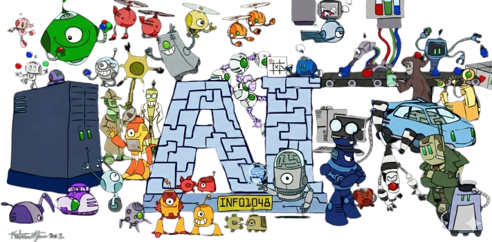

# Inteligência Artificial (INF01048)

Repositório da disciplina **INF01048 – Inteligência Artificial** do Instituto de Informática da UFRGS.

# Trabalhos

| # | Assunto | Data de Entrega | Repositório |
| --- | --- | --- | --- |
| 1 | Busca Cega | 30/março | [Link](https://github.com/lucasrafaelc/inf1048-IA/tree/main/Trabalho%201%20-%20Busca)

# Créditos
